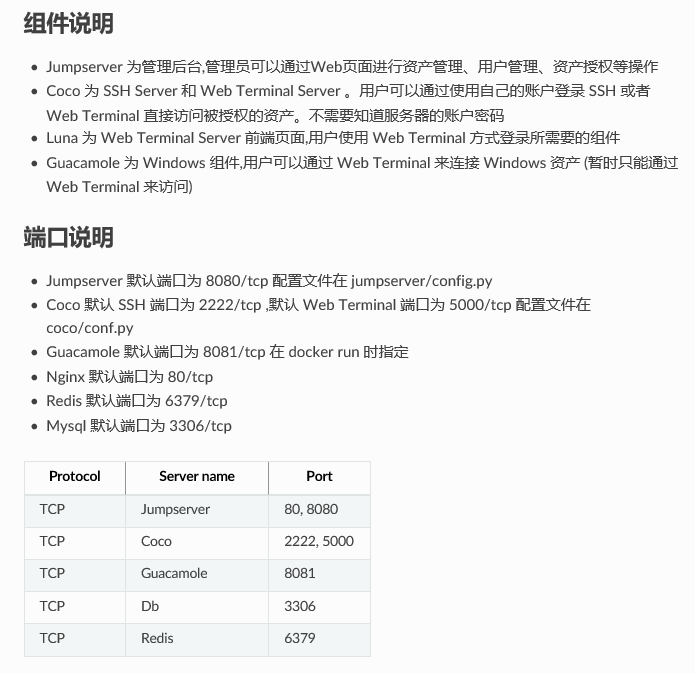

# 基础架构十五：两款运维操作工具

## 一、jumpserver

#### 总体介绍

  - 官方的名字叫保垒机或跳板机，其实就是能过WEB页面的方式来访问服务器，同时进行权限控制、操作记录、日志审计等，支持访问LINUX和WINDOWS主机
  - 官方说明：<http://docs.jumpserver.org/zh/docs/introduce.html>

#### jumpserver各组件组成

  - coco

    - 实现ssh和web Terminal，是jumpserver的子项目
    - <https://github.com/jumpserver/coco.git>

  - nginx+gunicom+django的结构：

    - gunicom:一个wsgi，把访问转发给后端的django主程序 <https://www.cnblogs.com/xybaby/p/6296974.html>
    - 基于django编写的主程序，实现jumpserver的主要页面功能

  - Guacamole，简单来说是一个远程桌面连接的网关，不是一个独立的Web应用程序，而是由许多部件组成的。Web应用程序实际上是整个项目里最小最轻量的，大部分的功能依靠Guacamole的底层组件来完成。 guacd是核心 <https://www.cnblogs.com/ji-yun/p/5657709.html>

    - 

      

#### 安装

  - <http://docs.jumpserver.org/zh/docs/quickinstall.html>
  - 直接使用docker启动：
    - ` docker run --name jms_all -d -p 80:80 -p 2222:2222 jumpserver/jms_all:latest`
    - 容器内的启动脚本
      - cat /usr/bin/[entrypoint.sh](http://entrypoint.sh)
```shell
#!/bin/bash
#
export LANG=zh_CN.UTF-8
if [ $DB_HOST == 127.0.0.1 ]; then
mysqld_safe &
fi
if [ $REDIS_HOST == 127.0.0.1 ]; then
redis-server &
fi
source /opt/py3/bin/activate
cd /opt/jumpserver && ./jms start all -d
/usr/sbin/nginx &
/etc/init.d/guacd start
sh /config/tomcat8/bin/startup.sh
cd /opt/coco && ./cocod start -d
tail -f /opt/readme.txt
```
##### 进程：
```shell
root         1  0.0  0.0  14968  3144 ?        Ss   11:12   0:00 /bin/bash /usr/bin/entrypoint.sh
root         6  0.0  0.0  15108  3188 ?        S    11:12   0:00 /bin/sh /usr/bin/mysqld_safe
root         7  0.3  0.1  42628  9256 ?        Sl   11:12   0:00 redis-server *:6379
mysql      143  0.6  1.3 1197072 113256 ?      Sl   11:12   0:00 /usr/libexec/mysqld --basedir=/usr --
root       183  0.0  0.0  15088  3508 pts/0    Ss   11:13   0:00 bash
root       209  0.0  0.2 125224 21180 ?        S    11:13   0:00 /opt/py3/bin/python3.6 /opt/py3/bin/g
root       212  4.2  1.2 511700 103780 ?       Sl   11:13   0:01 /opt/py3/bin/python3.6 /opt/py3/bin/g
root       213  4.0  1.2 659680 104356 ?       Sl   11:13   0:01 /opt/py3/bin/python3.6 /opt/py3/bin/g
root       214  3.0  0.9 392160 80388 ?        S    11:13   0:01 /opt/py3/bin/python3.6 /opt/py3/bin/g
root       215  4.3  1.3 971512 107584 ?       Sl   11:13   0:01 /opt/py3/bin/python3.6 /opt/py3/bin/g
root       233 18.1  1.3 453676 112340 ?       S    11:13   0:06 /opt/py3/bin/python3.6 -m celery work
root       234 15.3  1.2 446136 105848 ?       S    11:13   0:05 /opt/py3/bin/python3.6 /opt/py3/bin/c
root       260  0.0  1.2 452384 98616 ?        S    11:13   0:00 /opt/py3/bin/python3.6 -m celery work
root       261  0.0  1.2 452384 98668 ?        S    11:13   0:00 /opt/py3/bin/python3.6 -m celery work
root       262  0.0  1.2 452384 98692 ?        S    11:13   0:00 /opt/py3/bin/python3.6 -m celery work
root       263  0.0  1.2 452384 98632 ?        S    11:13   0:00 /opt/py3/bin/python3.6 -m celery work
root       270  0.0  0.1 116376 12188 ?        S    11:13   0:00 /usr/local/sbin/guacd -p /var/run/gua
root       281 37.6  2.2 4083864 184484 ?      Sl   11:13   0:07 /usr/bin/java -Djava.util.logging.con
root       285  0.0  0.0 125020  2240 ?        Ss   11:13   0:00 nginx: master process /usr/sbin/nginx
nginx      286  0.0  0.0 125452  7092 ?        S    11:13   0:00 nginx: worker process
root       287  0.0  1.2 453676 100024 ?       S    11:13   0:00 /opt/py3/bin/python3.6 -m celery work
root       317  0.1  0.6 256816 57160 ?        S    11:13   0:00 python3 ./cocod start -d
root       322  0.0  0.0   7660   692 ?        S    11:13   0:00 tail -f /opt/readme.txt
```

##### 端口：

```shell
State       Recv-Q Send-Q                   Local Address:Port                                  Peer Address:Port
LISTEN      0      1                            127.0.0.1:8005                                             *:*                   users:(("java",pid=281,fd=64))
LISTEN      0      50                                   *:5000                                             *:*                   users:(("python3",pid=317,fd=8))
LISTEN      0      100                                  *:8009                                             *:*                   users:(("java",pid=281,fd=52))
LISTEN      0      50                                   *:3306                                             *:*
LISTEN      0      128                                  *:6379                                             *:*                   users:(("redis-server",pid=7,fd=5))
LISTEN      0      5                                    *:2222                                             *:*                   users:(("python3",pid=317,fd=7))
LISTEN      0      128                                  *:80                                               *:*                   users:(("nginx",pid=285,fd=6))
LISTEN      0      128                                  *:8080                                             *:*                   users:(("gunicorn",pid=215,fd=6),("gunicorn",pid=214,fd=6),("gunicorn",pid=213,fd=6),("gunicorn",pid=212,fd=6),("gunicorn",pid=209,fd=6))
LISTEN      0      100                                  *:8081                                             *:*                   users:(("java",pid=281,fd=47))
LISTEN      0      5                            127.0.0.1:4822                                             *:*                   users:(("guacd",pid=270,fd=3))
LISTEN      0      128                                 :::6379                                            :::*                   users:(("redis-server",pid=7,fd=4))
LISTEN      0      128                                 :::80                                              :::*                   users:(("nginx",pid=285,fd=7))
```


#### web登陆：默认admin/admin

#### 功能 ：

  - 支持webTerminal连接Linux和Windows系统

    - 

      

  - 输入的每条命令都会实记录，审计功能强大

  - 批量处理任务比较弱，只提供一个命令执行界面：

    - 

      

---

## 二、awx

####  主页：<https://github.com/ansible/awx>

  - 有商业版本tower
  - 是ansible的web版
  - 无中文界面
  - 详细文档只有tower商业版的：<https://docs.ansible.com/ansible-tower/latest/html/administration/index.html>

#### 安装：可以装到k8s里， 我用的centos7+docker来安装：

  - <https://github.com/ansible/awx/blob/devel/INSTALL.md>
  - 需要docker-py、docker-compose包，只是这里注意要安装1.9版本的compose, 因为2.0以上会安装docker包，与docker-py冲突, ansible-playbook安装时会报错，无法引用docker-py：
```
pip install docker-py;
pip install docker-compose==1.9.0
```
  - 先clone一份：`git clone <https://github.com/ansible/awx.git>`
  - `cd awx/installer; ansible-playbook -i inventory install.yml`
  - web登陆：默认admin/password

#### 使用：配置好用户、inventory、project -》job--》playbook-》执行

  - 需要一个版本控制系统来存放playbook，在新建project时添加，我用内部的gitlab:
    
    - 
    
      
    
  - templates里设置job,关联到project/user/inventory,选择对应的playbook（需要先写好传到gitlab）
    
    - 
    
      
    
  - 执行的效果：
    
    - 
    
      

#### 功能：

  - 没有审计、webTerminal等功能
   
  - 批量任务执行功能强，只需编写playbook，设置好执行的user/inventory/即可

---

## 自行开发？

  - 大点的公司都会有自己的运维执行平台，以提高生产效率，小公司的话搞个开源的直接用比较合算

  - 这里有个**运维管理的框架**： <https://github.com/Thomas-YangHT/OPMS_v3>

  - 自己开发就离不开**CMDB**，其中一部分是资产管理信息，另一部分是软资源信息：

    - 

      

  - **三条命令搞定ansible批量执行**，好处是可以用上以前编写的各种SHELL脚本，不必再用playbook的yml语法重新组织逻辑：

    - 将test.sh拷贝到hosts.sel包括的所有主机
    `sudo -u root ansible -i /root/hosts.sel all -m copy -a 'src=/root/test.sh dest=~/test.sh mode=755' >/root/test1.log`
    - 执行每台主机上的 test.sh
    `sudo -u root ansible -i /root/hosts.sel all -m shell -a './test.sh >test.log'  >/root/test2.log`
    - 将每台服务器上的执行结果日志test.log取回放在/root/fetchd目录下以IP为名的子目录里
    `sudo -u root ansible -i /root/hosts.sel all -m fetch -a 'src=~/test.log dest=/root/fetchd'  >/root/test3.log`

  - 比较喜欢**[fabric1](https://github.com/fabric/fabric)**的简捷，即使目标主机上没有python环境也可以（比如CoreOS）：
```python
#!/usr/bin/python
from fabric.api import *
def upload():
    put('/root/collect.sh','/root/')
def executeit():
    run('sh collect.sh')
```

- **容器时代k8s**
  容器时代似乎所有的问题都可以在K8S里找到答案：
  - 监控由zabbix转为prometheus+grafana
  - 日志分析用EFK
  - 前端负载转发用KONG、ingress
  - 运维操作可以编写一个yaml文件搞定，轻松完成以前很难完成的任务。

