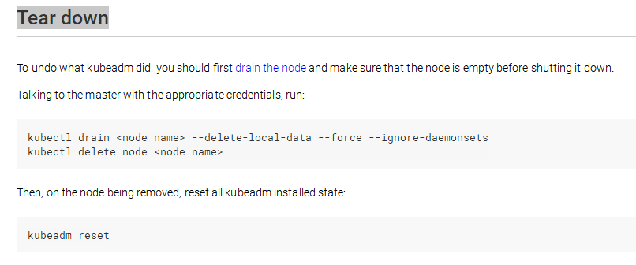

# 用kubeadm自动化安装k8s-HA_1.13.0

## 缕一缕K8S-1.13.0-HA的官方安装说明

#####   [图片资料来源于官方网站 ](https://kubernetes.io/docs/setup/)

##  1.改进

* ####  新版本对安装进行了改进
可以使用kubeadm join来加入其它master结点，并承诺将来的安装会更快速简便
* ####   对HA集群的改进
高可用集群在1.12版是不推荐的alpha版，1.13.0已移除，变为了v1beta1

##  2.各版本提供支持的时间段
##### 1.13.X到2019年9月

##  3.两种HA拓扑结构

* #####  内建etcd集群的架构-stacked etcd 

  

* #####  外部etcd集群的架构-external etcd 

  ##### （我选后一种，需要先配好Haproxy+Keepalived+etcd的集群三件套）

##  4.各结点上应用组件占用的端口

##  5.支持的各种虚拟网络，以及Calico网络的的配置方法

##  6.使用CoreOS（即Container Linux）时，安装CNI、CRI、kubeadm/kubectl/kubelet的方法，也可以用在其它LINUX上

##  7.从集群移除结点时

# 安装
---
##  1.几种自动化安装脚本

* #### [K8S中文社区推荐的安装脚本，用的人很多](https://github.com/Lentil1016/kubeadm-ha)
* #### [叫cookcode的大牛写的，只到1.11版，没更新](https://github.com/cookcodeblog/k8s-deploy)
* #### [我写的自动安装脚本，用在CoreOS上，欢迎使用](https://github.com/Thomas-YangHT/k8s-ha-autoinstall) （也能用在Centos7上，不过要做适用性配置）
---
##  2.安装时下不到镜相怎么办？

* #### just try: docker pull [registry.cn-hangzhou.aliyuncs.com/google_containers/](http://registry.cn-hangzhou.aliyuncs.com/google_containers/)<镜相名>
* #### [gcr.io_mirror](https://github.com/Thomas-YangHT/gcr.io_mirror)
* #### [某大牛的自动下载SHELL](https://github.com/Thomas-YangHT/kubernetes-tools/tree/master/kubeadm/2-images)
* #### 科学上网
* #### 使用公有云镜相海外构建，可以百度一下方法
* #### 参考上面自动化安装给出的离线镜相包
---
##  3.遇到问题怎么解决？

* #### [关注这个issues,有很多问题及解决办法](https://github.com/Lentil1016/kubeadm-ha/pulls?utf8=%E2%9C%93&q=)
* #### [官方的常用问题](https://kubernetes.io/docs/setup/independent/troubleshooting-kubeadm/)
* #### [官方的issues](https://github.com/kubernetes/kubernetes/issues)(2000+，太多了，不敢watch)
----

##  kubernetes的主要特点

* #### 服务发现与负载均衡
* #### 支持各种后端存储架构编排
* #### 自动化的滚动更新与回滚
* #### 批量执行
* #### 自动化装箱，即按需分配容器到结点
* #### 自愈，当结点故障或由用户定义的健康检查失败时，自动重启、替换和重新调度容器，直至恢复健康状态
* #### 密钥认证与设置管理
* #### 水平伸缩
---
##### 相关链接
[Github K8S代码](https://github.com/kubernetes/kubernetes)
[k8s中文社区](https://www.kubernetes.org.cn/)

-----

## 我的自动安装脚本说明

##### 前言：

本节介绍k8s高可用集群的自动化安装

版本：

* k8s 1.12.1、1.13.0

* coreOS1855

##### 最新安装说明见：README: <https://github.com/Thomas-YangHT/k8s-ha-autoinstall/blob/master/README.md>

##### 准备工作：

完成前篇《基础架构八：coreOS的安装》

##### 相关代码与资源：

* 安装脚本

​       git clone <https://github.com/Thomas-YangHT/k8s-ha-autoinstall.git>

* 下载需要的镜相，百度网盘 ：

​         *  coreos-k8s.tgz <https://pan.baidu.com/s/1KT6ZzDic3sAfaY0QlQZbTw>

​         *  ha.tgz <https://pan.baidu.com/s/1Cj_BAiohKnZOi2MKCEX10g>

​         *  coreosbase2.tgz <https://pan.baidu.com/s/141I6ctxuGtFfiD8tRHfz_g>

* 或者 git clone <https://github.com/Thomas-YangHT/coreos-k8s-ha-tgz-zip.git>

##### HA基本结构：

3主多从, 坏任一台不影响集群工作

前端：keepalived’s VIP+haproxy’s 8443 to real IP’s 6443

3Master组成控制平台，再增加任意个工作结点

可参考上节external_etcd图例

## 01 文件说明

* CONFIG    —-安装配置文件

* install.sh  —-安装执行脚本

* fab_inst.py —-fabric执行程序，由install.sh调用

* coreos-tgz —-k8s1.12.1所需基础镜相与配置

* ha.tgz       —-keepalived/haproxy/etcd三个集群安装基础镜相

* coreosbase2 —-CoreOS 1855.4版本KVM基础镜相 20G硬盘；

* 其它文件说明见README.md

##　02　安装步骤

#####  一.下载好相关文件放于同一目录

见（相关代码与资源）

  ##### 二.调整好KVM虚拟机并clone三主一从（可多从）；

 ##### 三.修改CONFIG配置文件相关IP与主机名；
三主一从的配置示例 ：

* 红色部分是三主一从及VIP等配置，需要根据实际情况修改

* 绿色部分用于clone虚拟机脚本自动配置

 ##### 四.执行安装: sh -x install.sh allha

##　03 验证安装

安装完毕会显示dashboard 的nodeport端口与登陆token

使用firefox 登录dashboard：（任一结点IP的nodeport端口）

## 脚本相关步骤分解说明：

##### keepalived

docker run脚本： docker-keepalived.sh 由fab-inst.py安装时调用在每台服务器上运行

##### haproxy

haproxy.cfg ：由haproxy_conf.sh根据CONFIG自动生成，不必理睬

docker run脚本： docker-haproxy.sh 由fab-inst.py安装时调用在每台服务器上运行

##### etcd

SSL证书生成脚本：etcdssl.sh生成证书放于SSL目录，自动调用不必理睬

docker run脚本：docker-etcd.sh 由fab-inst.py安装时调用在每台服务器上运行

配置参考：<https://kubernetes.io/docs/setup/independent/setup-ha-etcd-with-kubeadm/>

##### 状态检查：etcdctl —key-file ssl/etcd-key.pem —cert-file ssl/etcd.pem —ca-file ssl/ca.pem —endpoints=<https://192.168.253.31:2379cluster-health>

sh install.sh etcdcheck

##### installha.sh p1: 

准备好coreos-k8s.tgz, k8s1.13.0基础镜相到各服务器

##### installha.sh p5：

准备好ha.tgz，包括config/haproxy/keepalived/etcd，并启动集群三件套haproxy/keepalived/etcd

##### master1:

kubeadm init —config kubeadm-config.yaml

tar ca files

get 回宿主机

init后，三running三pending状态正常：

##### master2:

scp 到master2/3

master2/3: 

1.12.1版本时： kubeadm init —config kubeadm-config.yaml

1.13.0版本：直接用kubeadm join命令加入master1

##### calico网络

见问题一

##### dashboard:

1.10版本，需token登陆，见验证环节

##### node:

结点 join到集群

## 05 Q&A

##### 问题一：calico 网络问题：

官方的calico.yaml需要两处修改，一是CIDR子网地址，二是autodetect方法，详见：<https://github.com/Thomas-YangHT/k8s-ha-autoinstall/blob/master/calico/calico.yaml>

#####  问题二：无外网情况下，kubeadm init 后，无coredns/kube-proxy的pods出现：

调通网络

#####  问题三：k8s集群kubeadm的官方介绍方法有两种：

方法一是使用k8s自身的etcd，安装起来速度慢，常出现莫名的故障；

方法二即自建外部etcd的方法，速度快且稳定，install.sh采用此方法；

#####  问题四：重新安装

先执行 sh install.sh reset

#####  问题五：etcd备份

etcd集群数据：/var/lib/etcd

calico etcd数据： /var/etcd

##  06 install.sh的更多用法
 

**Writed  By  LinuxMan：**

